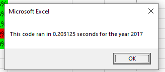
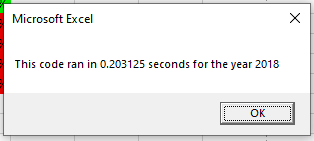

# VBAC_CHALLENGE
# #Overview
The purpose of the analysis was to see how refactoring of the code can be a key part of the process. It is supposed to show how refactoring someone else’s code can lead to a major jump in performance. And the analysis of stock market is supposed to show how manipulating with few thousands stock data can be used to make profit on the stock market.
### Results
Here we can see an example of the code that ran in less than a second that shows the analysis of the stock market in the years 2017 and 2018.

#### Summary of Results
This is the main functionality of the code, the rest is more or less just formatting. The code loops through all of the rows and detects when the stock type is changing, when it doesn’t change it adds to the total daily volume which it shows in the table.
Results
	Refactoring doesn’t necessarily change the functionality of the code, but it can significantly improve its performance, which ultimately saves everyone time and money. It doesn’t necessarily improve performance that much on small scale projects but on large scale project it definitely can drastically help with performance. It also makes code easier to read, understand and maintain. However, one should not attempt to refactor code at all costs, it should be avoided it if exceeds budget and time.
	In our example, refactoring the original VBA script greatly improved performance and ultimately it was definitely worth doing.
